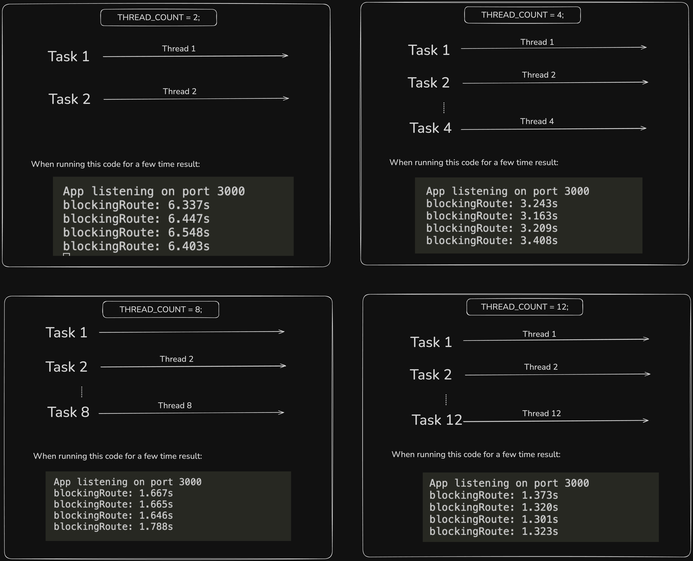

# JavaScript Multithreading Examples

This repository demonstrates how to implement multithreading in JavaScript using the `worker_threads` module. The examples show how to leverage multiple CPU cores for parallel processing to improve performance in Node.js applications.

## Project Structure

```
.
└── 01MultiThreading
    ├── 01-blocking_main_thread      # Example of blocking operations
    ├── 02-extra_thread_worker       # Single worker thread implementation
    └── 03-multi_thread_worker       # Multiple worker threads implementation
```

## Examples Overview

1. **Blocking Main Thread**:

   - Demonstrates how CPU-intensive tasks can block the main thread
   - Shows why multithreading might be necessary

2. **Single Worker Thread**:

   - Implementation of a basic worker thread
   - Shows how to offload tasks to a separate thread

3. **Multiple Worker Threads**:
   - Advanced implementation using multiple worker threads
   - Demonstrates parallel processing capabilities

## Performance Comparison

The following image shows the runtime performance comparison when utilizing different numbers of cores/threads:



## Getting Started

1. Clone the repository
2. Navigate to any example directory

```bash
cd 01MultiThreading/01-blocking_main_thread
```

3. Install dependencies

```bash
npm install
```

4. Run the example

```bash
node main.js
```

## Prerequisites

- Node.js version 12.x or higher (worker_threads are stable from Node.js 12.x)
- Basic understanding of JavaScript and Node.js

## Key Concepts Covered

- Worker Threads in Node.js
- CPU-intensive task handling
- Parallel processing
- Thread pool management
- Inter-thread communication

## Usage Notes

Each example directory contains:

- `main.js`: The primary script that initializes and manages threads
- `worker.js`: (where applicable) Contains the worker thread code
- `package.json`: Project dependencies and scripts

## Contributing

Feel free to submit issues, fork the repository, and create pull requests for any improvements.

## License

MIT
